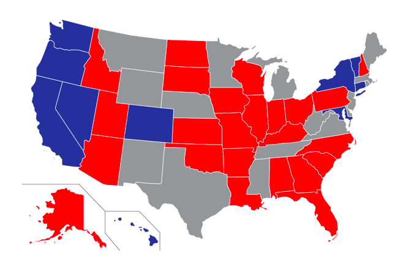

```{r setup, include=FALSE}
knitr::opts_chunk$set(
  message = FALSE,
  echo = TRUE,
  warning = FALSE
)
library(tidyverse)
library(sds192)
library(ggplot2)
library(ggthemes)
library(dplyr)
```

## Introduction
What role do contributions play in senate elections?  Using data from the fec16 package[^1], we strive to shed some light on this question by examining campaign contributions during the 2016 senate elections for California and Nevada. We chose to examine California as not only is it the home of all the authors, but also because it is one of the three states that uses a top-two primary system in which the top two winners from the primary election move on to the general election regardless of party affiliation.[^2] In 2016 this was particularly relevant as both general election candidates, Kamala Harris and Loretta Sanchez, were from the Democratic Party. On the other hand, we chose Nevada because it uses a closed primary system rather than a top-two primary system, meaning only voters who are registered with a particular political party can vote in that party’s primary election, and because it was one of the competitive battleground races.[^3]

**NOTE:** The contributions shown are limited to 24A and 24E transactions, which are transactions opposing the candidate and transactions advocating  for the candidate respectively. 

Our code can be found on GitHub.[^github]



[^1]: Marium Tapal, Rana Gahwagy, Irene Ryan and Benjamin S. Baumer
  (2020). fec16: Data Package for the 2016 United States Federal
  Elections. R package version 0.1.3. 
  [https://CRAN.R-project.org/package=fec16](https://CRAN.R-project.org/package=fec16)
[^2]:[California 2016 Senate Elections]( https://ballotpedia.org/United_States_Senate_election_in_California,_2016#cite_note-6)
[^3]: [Nevada 2016 Senate Elections](https://ballotpedia.org/United_States_Senate_election_in_Nevada,_2016)
[^github]: [our GitHub repository](https://github.com/sds192-i21/mp2-pacific-a)

## Loading the data

```{r, message=FALSE, eval = TRUE}
library(fec16)
contributions_all <- read_all_contributions()
```

## California Election


```{r}
# filter for CA senate candidates
cali_candidates <- candidates %>%
  filter(cand_office_st=="CA" & cand_office == "S") 
comm_cand <- cali_candidates %>%
  left_join(contributions_all, by=c("cand_id"="cand_id"))%>%
  filter(transaction_tp=="24A" | transaction_tp=="24E")
```

```{r}
# CA contributions by type
ca_transactions <- comm_cand %>%
  group_by(transaction_tp) %>%
  summarize(num_transactions = n(),
            transaction_total = sum(transaction_amt))

ggplot(data=ca_transactions, aes(x=transaction_tp, y=transaction_total, fill=transaction_tp))+
  geom_col()+
  scale_fill_manual("Transaction Type", values = c("24A"="indianred1","24E"="seagreen1"), labels = c("24A (opposing)", "24E (supporting)" ))+
  labs(title = "California's Distribution of Campaign Money") +
  xlab("Transaction Type") +
  ylab("Transaction Total ($)")
```

```{r}
# CA contributions by candidate
ggplot(data = comm_cand, aes(x=reorder(cand_name,transaction_amt), y=transaction_amt, fill=transaction_tp))+
geom_bar(stat='identity')+
  scale_fill_manual(values = c("24A"="indianred1","24E"="seagreen1"), labels = c("24A (opposing)", "24E (supporting)" ))+
  scale_y_continuous(breaks = c(0,500000, 1000000), labels = c("0", "500,000", "1,000,000")) +
  labs(title = "Campaign Contributions",
       subtitle = "Senate candidates from CA in 2016 elections",
       fill = "Transaction Type") +
  ylab("Transaction Amount ($)")+
  xlab("Candidate Name")+
   theme(legend.position=c(0.8, 0.2))+
  coord_flip()
```

Kamala Harris and Loretta Sanchez are Democrats while George Sundheim and Thomas Del Becarro are Republicans.

## Nevada Election


```{r}
# filter Senate candidates from Nevada
nv_candidates <- candidates %>%
  filter(cand_office_st == "NV" & cand_office == "S")

nv_money <- nv_candidates %>%
  left_join(contributions_all, by=c("cand_id"="cand_id")) %>%
  filter(transaction_tp == "24A" | transaction_tp == "24E")%>%
  select(cand_name, cand_pty_affiliation, cand_election_yr, cand_office, transaction_tp, transaction_amt)
```

```{r}
# NV contributions by type
nv_transactions <- nv_money %>%
  group_by(transaction_tp) %>%
  summarize(num_transactions = n(), transaction_total = sum(transaction_amt))

ggplot(data=nv_transactions, aes(x=transaction_tp, y=transaction_total, fill=transaction_tp))+
  geom_col()+
  scale_fill_manual("Transaction Type", values = c("24A"="indianred1","24E"="seagreen1"), labels = c("24A (opposing)", "24E (supporting)" ))+
labs(title = "Nevada's Distribution of Campaign Money")+
  scale_y_continuous("Transaction Total ($)", breaks = c(0, 20000000, 40000000, 60000000), labels = c("0", "20,000,000", "40,000,000", "60,000,000")) +
  xlab("Transaction Type")
```
    
```{r}
# NV contributions by candidate
ggplot(data = nv_money, aes(x=reorder(cand_name,transaction_amt), y=transaction_amt, fill=transaction_tp))+
  geom_bar(stat='identity') +
  scale_fill_manual(values = c("24A"="indianred1","24E"="seagreen1"), labels = c("24A (opposing)", "24E (supporting)" ))+
  scale_y_continuous(breaks = c(0, 10000000, 20000000, 30000000, 40000000), labels = c("0", "10,000,000", "20,000,000", "30,000,000", "40,000,000")) +
  labs(title = "Campaign Contributions",
       subtitle = "Senate candidates from NV in 2016 elections",
       fill = "Transaction Type") +
  ylab("Transaction Amount ($)")+
  xlab("Candidate Name")+
   theme(legend.position=c(0.8, 0.2))+
  coord_flip()
```

Joe and Thomas Heck are Republicans while Catherine Cortez Masto is a Democrat.

## Analysis

Graphs of campaign contributions for the 2016 senate election in California and Nevada showed that some candidates were favored over others. In California, candidates George ‘Duf’ Sundheim and Loretta Sanchez only had supporting transaction types. Thomas Del Beccaro only had opposing transactions, showing that he was not a popular candidate but instead a candidate the people opposed. Kamala D. Harris had a mixture of supporting and opposing transactions unlike Sanchez and Sundheim; however, if we take a look at the x-axis on the graph we can see that she had far more transactions, mostly supporting, than any other candidate. Kamala D. Harris won the 2016 senate election and has now become our first vice president who is not only a woman, but a woman of color. 

Looking at the Nevada race we can see disparities between Nevada’s 2016 Senate election and California’s. One of the biggest differences is that all candidates in Nevada had both opposing and supporting contributions. Thomas Heck received few supporting and opposing contributions. Evidence shows that he was not a popular candidate while evidence for Joe Heck shows that he was not a favored candidate by far. Well over half of Joe Heck’s transactions were opposing ones which greatly overshadowed his supporting transactions. Catherine Cortez Masto was the winner of this election. Unlike the California senate elections where there were obvious favorites, support for candidates in the Nevada senate elections was clearly divided. 

## Conclusion

We learned campaign contributions to Senate candidates in the 2016 election were used to support candidates and to oppose them. But, the distribution of money between types of transactions and between candidates depended on the political climate of the state. 

California is a very blue state, and both candidates that made it to the general election were Democrats. In this situation, most campaign contributions were used to support candidates. Kamala Harris, the winner, received the most supportive money.

The Senate election in swing state Nevada was much more contentious. The top two candidates were a Democrat and a Republican. In this situation, considerably more money was spent overall and a far greater proportion of the money was spent opposing candidates than supporting them. However, Catherine Cortez Matso won despite receiving more oppositional money and less supportive money than Joe Heck. 

So in general, when Senate elections are more contentious, more money is spent and more of that money is used to oppose candidates. But, receiving more contributions (supporting or opposing) does not necessarily indicate success in the election.


## Word count

```{r word_count, message=FALSE, echo=FALSE}
text_stats()
```

## Standards

In this assignment, we attempted the following [standards](https://beanumber.github.io/sds192/standards.html):

- `r standard_button("wrangling")`: We met the Wrangling standard because we utilized the dplyr package and its features including group_by(), filter(), select(), and summarize() in order to perform basic data wrangling.

- `r standard_button("relational")`: We met the Relational standard because we combined multiple data frames from the fec16 package (candidates and contributions) in order to construct our data graphics.

- `r standard_button("aesthetics")`: We mastered the Aesthetics standard because we made use of the available geoms such as geom_bar() and geom_col() in order to customize our graphics. We also explored various color palettes when creating our graphics. 

- `r standard_button("context")`: We mastered the Context standard because we created multiple graphs which are easy to read and tell a story regarding the results of the 2016 senate election in California and Nevada. 


- `r standard_button("markdown")`: We mastered the R Markdown standard because we had no loading or error messages in our code. We also included a variety of web elements including data graphics, links, and code chunks in R Markdown. 

- `r standard_button("github")`: We mastered the GitHub standard because we successfully utilized push and pull features to work together as a group. We also used GitHub to resolve merge conflicts by utilizing MWE.

- `r standard_button("ethics")`: We mastered the Ethics standard because we used published resources for guidance from the Federal Election Commission and chose color, labels, and scales to make our graphs comparable and avoid being misleading. 


## References
- [https://stackoverflow.com/questions/61068031/error-stat-count-can-only-have-an-x-or-y-aesthetic](https://stackoverflow.com/questions/61068031/error-stat-count-can-only-have-an-x-or-y-aesthetic)
- [http://www.sthda.com/english/wiki/ggplot2-axis-scales-and-transformations](http://www.sthda.com/english/wiki/ggplot2-axis-scales-and-transformations)
- [https://stackoverflow.com/questions/38788357/change-bar-plot-colour-in-geom-bar-with-ggplot2-in-r](https://stackoverflow.com/questions/38788357/change-bar-plot-colour-in-geom-bar-with-ggplot2-in-r)
- [https://www.rgj.com/story/news/politics/2016/10/11/heck-and-cortez-masto-outspent-outside-groups/91747818/](https://www.rgj.com/story/news/politics/2016/10/11/heck-and-cortez-masto-outspent-outside-groups/91747818/)
- [https://ktla.com/news/politics/california-u-s-senate-election-results-kamala-harris-projected-to-win/](https://ktla.com/news/politics/california-u-s-senate-election-results-kamala-harris-projected-to-win/)
- [https://www.rpubs.com/dvdunne/reorder_ggplot_barchart_axis](https://www.rpubs.com/dvdunne/reorder_ggplot_barchart_axis)


